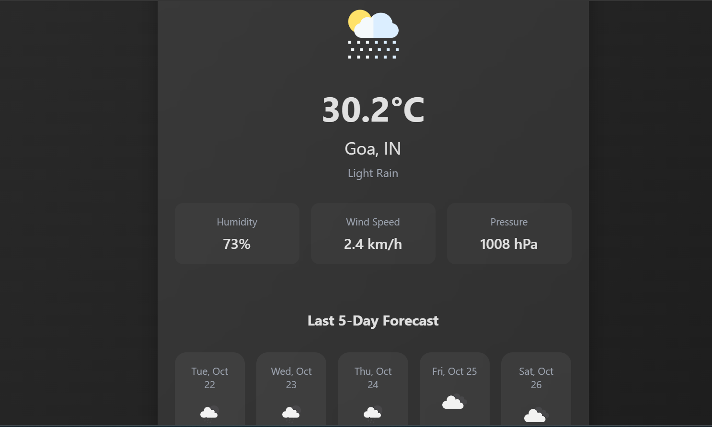

# Weather Forecast App

A simple and responsive weather app that provides real-time weather data and a 5-day forecast for any city using the [OpenWeatherMap API](https://openweathermap.org/). The app allows users to switch between Celsius and Fahrenheit, and also set custom weather alerts based on temperature and wind speed.

### Features

- **Real-Time Weather**: Get current weather conditions including temperature, humidity, wind speed, and atmospheric pressure.
- **5-Day Forecast**: Displays weather data summary for the last 5 days.
- **Unit Conversion**: Switch between Celsius (°C) and Fahrenheit (°F) easily.
- **Custom Alerts**: Set alerts for high/low temperatures and strong winds.
- **Responsive Design**: Works seamlessly on both desktop and mobile devices.

### Demo

  
(Add the live screenshot image)

[Live Demo](#)

````bash
    https://ananda-2.github.io/Weather-App/

### Installation

1. Clone the repository:
   ```bash
   git clone https://github.com/your-username/weather-forecast-app.git
````

2. Navigate to the project folder:

   ```bash
   cd weather-forecast-app
   ```

Open the index.html file in your browser:

open index.html
(Or simply double-click index.html)

### Usage

- **Search for a City:** Type the name of the city in the search bar and press Enter.
- **Switch Units:** Click the Celsius (°C) or Fahrenheit (°F) button to toggle the temperature unit. -**Custom Alerts:** Set temperature and wind speed thresholds by opening the "Threshold Settings" modal.
  API Key Setup
  You need an API key from OpenWeatherMap to fetch weather data.
